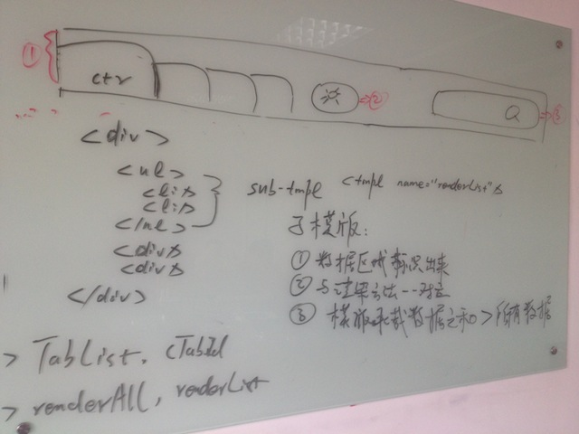

#BRIX组件架构2
##复杂报表展示系统组件化分析

>通过复杂报表组件化的过程，整理组件实现中的细节。

上图是subway报表系统的核心列表页面。  
**基于具体业务进行组件拆解工作。**

**报表系统将被分解为8个组件**，如上图：

1. Tab：Tab导航
2. TabConfiger：Tab导航配置
3. SchBox：搜索框
4. ComplectDropDown：复杂过滤条件
5. SimpleDropDown：简单过滤条件
6. ViewConfiger：视图定义
7. ListTable：列表
	1. PageInfo1：分页信息区1 隶属于列表组件
	2. PageInfo2：分页信息区2 隶属于列表组件
8. ViewSelect：视图选择区

**组件分析的若干维度：**

- 基础模板 
- 承载数据、状态数据
- 属性、方法、事件
- 子组件、父组件
- 结合具体业务进行数据流分析

数据为特殊的属性，但我们需要对数据表示特别的关注
对于Tab组件而言，数据包含两部分：TabList 和 CurrentTabID

为使组件模板中可以通过添加html节点，随意嵌入其他外部组件，引入子模板机制：

1. 将关键数据区域标识出来
2. 建立 数据 与 子模板 与 渲染方法 的一一对应，支持局部依照变化了的数据和子模板重新渲染
3. 所有子模板承载数据之和>所有数据，校验数据完整性

*这解决了Magix中View过大，整个View重刷带价过大的问题。*

*子模板机制保障了Tab和TabConfiger两个组件，虽然DOM结构上存在父子关系，但是是两个独立的组件，可以按照组件间交互模式交互*

改变组件渲染的生命周期：

1. 获取数据
2. 获取模板
3. 输出模板渲染后的HTML
4. 将其他组件行为附加到HTML上

结合用expando标识events信息以及在模板内的完成状态渲染逻辑，将YUI Widget 组件初始化的SyncUI，BindUI工作转移至模板中。

其中步骤1、2、3可以在后台执行，也可以在前台执行。
当组件凭空创建时，也需要遵照1、2、3顺序。

*组件生命周期的1、2、3步骤，天然可以转移至NodeJS在后台执行*

采用约定管理任务的执行顺序，管理任务是否可以并行，管理任务间的依赖。
这样按照之前约定对任务的描述，每个任务可以以异步方式执行，同样可以以同步方式执行。可以并行的任务依然可以串行执行。

